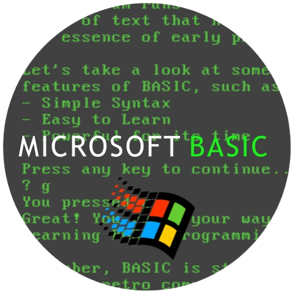

<!-- Love you all, fr! <3 -->

  
  # :heart: Haiiii, I'm Squirrel :3
  

   
  
  ## 🛠️ Languages I Use

  

    
    
    
    
    
    
    
  

  
  <!-- (this was commented out cause I don't really use it)-->
  <!-- (this was commented out cause I don't really use it)-->
  <!-- (this was commented out cause I don't really use it)-->
  <!--  (this was commented out cause I don't really use it)-->
  <!-- (this was commented out cause I don't really use it)-->
  <!-- (this was commented out cause I don't really use it)-->
  <!-- ^ I made this btw !!!-->

## 💫 About Me :3

<table>
  <tr>
    <td width="60%" style="vertical-align: top; border: none;">
      

        <b>
        
i am good at coding when i want to be 💔

        </b>
      

    </td>
    <td width="40%" style="border: none;">
      
    </td>
  </tr>
</table>

  ## 🌐 Socials

  
  
  
<i>More socials coming soon...</i>

  ## 🎵 Currently Listening To
  

  ## 🌟 Other Cool Stuff
  
  <a href="https://discord.gg/T9z27hv7FN">
    
     
    <b>The Freakcord Server :3</b>
  </a>

  

    
<b>🔠Some of My Favorite Websites</b>

     
    

      
      
      
      
      
      
      
    

  

  

    
<b>📬 Ways to Contact Me</b>

    

      
      
    

  

  ## 📝 Badge things
  
  

  
  

